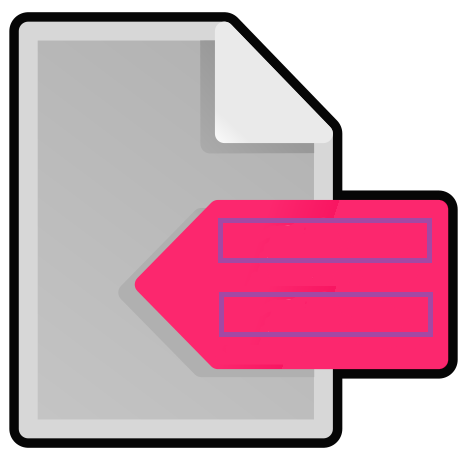

<div align="center">
   <h1>Code and Clone Annotation</h1>
</div>

Assign clone class labels to files containing code pairs. Highlight and label code chunks in code files to identify core similarities, non-core similarities and dissimilarities.

Find the detailed code and clone labeling guideleine [here](https://github.com/shamsa-abid/Code-Clone-Causal-Interpretation/blob/main/CodeAndCloneAnnotationTool/Code%20Pair%20Labeling%20Guidelines.pdf).


The "Code and Clone Annotation" can be found in the Activity pane.

## Features

- Create an annotation from the source code, selecting the portion of code, right-clicking and adding a label
- Keybinds for creating a new core similarity label from selection (`Ctrl/Cmd + alt + c)`
- Keybinds for creating a new non-core similarity label from selection (`Ctrl/Cmd + alt + n)`
- Keybinds for creating a new dissimilarity label from selection (`Ctrl/Cmd + alt + d)`
- Keybinds for creating a true clone label (`Ctrl/Cmd + alt + t)`
- Keybinds for creating a false clone label (`Ctrl/Cmd + alt + f)`
- Track code chunk labels on Code Annotation View pane
- Track clone labels on Clone Annotation View pane
- Remove/delete code and clone labels using bin icon in tree view
- Check/uncheck clones in clone annotation tree view to flip clone label
- Rename a code label with right click on code label in code annotation tree view and choose 'Edit Label' from menu
- Click on file name in clone annotation view and press 'refresh' button in code annotation view to view code labels
- Generate json output of code labels using 'summary' button of code annotation view 
- Generate json and csv output of clone labels using 'summary' button of clone annotation view 

# Installing Using a VSIX file
Download the [VSIX file](https://github.com/shamsa-abid/Code-Clone-Causal-Interpretation/blob/main/CodeAndCloneAnnotationTool/code-annotation-0.0.10-dev.vsix) and follow the steps on your VSCode:

1. Go to the "Extensions" pane
2. Click on the ... on the top right of the "Extensions" pane
3. Select "Install from VSIX"
4. Select the VSIX file you downloaded and click install

# Development

- For the development you'll need to use VSCode
- Install Node/Npm
- After forking/cloning the repository, run:
```
npm install
npm run compile
```
- And to run/test the extension, go the the Run pane and hit the green button on `Run Extension`. This will open a new VSCode window with the extension enabled.

## Creating a VSIX file for instalation

- "Compile" the extension as usual
  - `npm install`
- Install vsce
  - `npm install -g vsce`
- Create the VSIX file
  - `vsce package`

# View the existing annotations
To reuse the existing annotations and deploy the existing annotation database in your machine, you can follow the instructions below. 

1. Suppose we want to view the author 1 and author 2's annotations for codes in code-samples, after installing Code Annotation, open "Extension Settings" of Code Annotation and change the FilePath into the absolute path of folder "author1labels" and "author2labels" in your machine.
2. Select a clone file in folder "code-samples" and go to Code Annotation Bar, click refresh buttons beside Code Annotation View and Clone Annotation View then you are able to see the labels. 
3. Wait a while if you cannot see the labels and refresh again. It may take a few seconds to load the annotation database into VS code.
